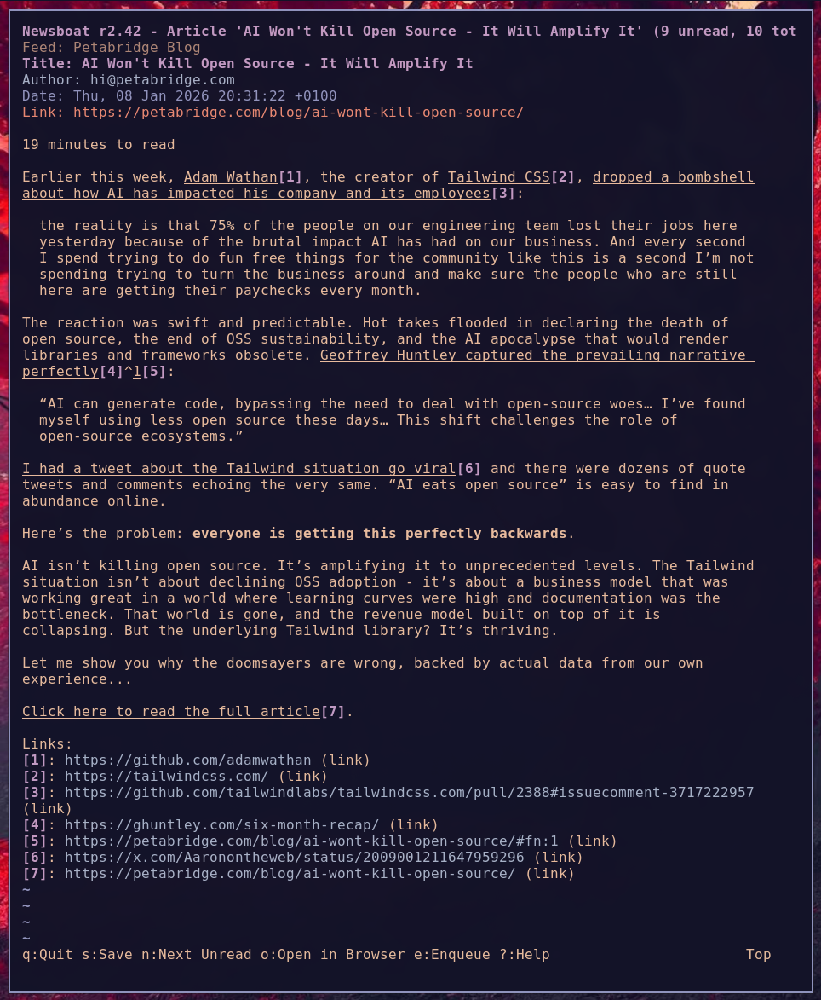

# Red Forest Theme for Newsboat

A warm, dark color theme for [Newsboat](https://newsboat.org/) RSS reader.

Based on the [Red Forest Theme](https://github.com/AlexZeitler/omarchy-red-forest-theme) for [Omarchy](https://omarchy.org).

## Installation

1. Clone this repository:
   ```bash
   git clone https://github.com/alex/newsboat-red-forest-theme.git
   ```

2. Create a symlink to the theme:
   ```bash
   ln -sf /path/to/newsboat-red-forest-theme/theme ~/.config/newsboat/theme
   ```

3. Include the theme in your `~/.config/newsboat/config`:
   ```
   include "~/.config/newsboat/theme"
   ```

## Screenshot



## License

MIT
